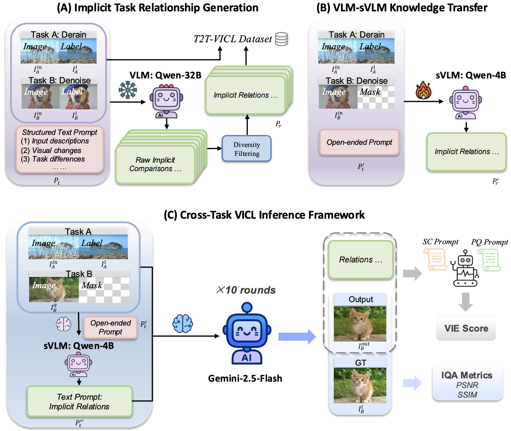
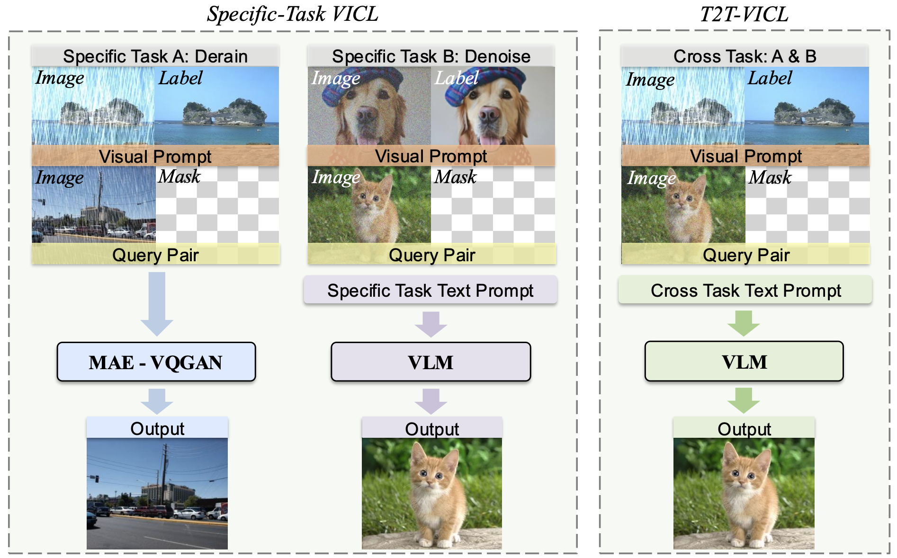

<h1 style = "text-align:center;">T2T-VICL: Cross-Task Visual In-Context Learning via Implicit Text-Driven VLMs</h1>

<div align="center">

</div>

<p style="margin-top: 20px; margin-bottom: 20px" align="center">
  <a href="https://arxiv.org/abs/2511.16107"></a>
  <a href="https://github.com/ZhangHuixin1103/Task-Transfer"></a>
  <a href="https://drive.google.com/drive/folders/1INgcoOhSBgWYdB-Ec_qiBGnyPCTLDiGk"></a>
  <a href="https://huggingface.co/datasets/ZhangHuixin/VICL"></a>
</p>

This repository contains the official implementation of **T2T-VICL**, a collaborative framework for studying **cross-task visual in-context learning (VICL)**. In standard VICL, the demonstration pair and the query usually belong to the same visual task. T2T-VICL studies a harder setting: the visual prompt comes from **Task A**, while the query image requires **Task B**.

<div align="center">

</div>

The core idea is to translate mismatched visual demonstrations into **implicit textual guidance**. A large teacher VLM first describes the relationship between two low-level vision tasks without explicitly naming the tasks. A smaller Qwen-VL student is then fine-tuned to generate such content-dependent prompts from three images: Task A input, Task A output, and Task B input. The generated prompt guides a frozen image-editing VLM, and multiple candidates are evaluated with PSNR, SSIM, and VIEScore.

## Method Overview

T2T-VICL has three main stages:

1. **Implicit task relationship generation**
   - A teacher VLM, Qwen2.5-VL-32B-Instruct in the paper, receives two paired examples: `(Task A input, Task A output)` and `(Task B input, Task B output)`.
   - It produces a structured implicit description covering image content, visual changes, and task differences.
   - Descriptions are filtered for diversity with sentence-embedding based deduplication.

2. **VLM-to-sVLM knowledge transfer**
   - The teacher descriptions are converted into Qwen-VL conversation format.
   - Qwen3-VL-4B-Instruct is fine-tuned as a lightweight prompt generator.
   - At inference time, the student only sees `(Task A input, Task A output, Task B input)` and predicts the implicit prompt.

3. **Cross-task inference and score-based selection**
   - The generated implicit prompt is passed to an image-editing VLM together with the three input images.
   - Candidate outputs are evaluated using PSNR, SSIM, and VIEScore.
   - For stochastic APIs such as Gemini and Seedream, the paper samples multiple candidates and selects the highest-PSNR output before reporting SSIM and VIEScore.

## Vision Tasks

The benchmark covers 12 low-level vision tasks:

| Category | Tasks |
| --- | --- |
| Restoration | deblurring, dehazing, demoireing, denoising, deraining |
| Removal | reflection removal, shadow removal |
| Generation / Enhancement | colorization, harmonization, inpainting, light enhancement, style transfer |

The released training set contains implicit descriptions for 26 cross-task pairs, with 2,000 samples per pair in the current local dataset. Evaluation files contain 100 samples per pair for the cross-task benchmark, plus same-task files for ablation experiments.

## Structure

```text
Task-Transfer/
|-- data.py                     # Generate teacher implicit descriptions
|-- data_process.py             # Convert descriptions to Qwen-VL SFT format
|-- eval.py                     # Main Gemini-based cross-task evaluation pipeline
|-- eval_*.py                   # Evaluation backends and ablations
|-- eval.sh                     # Example evaluation commands
|-- data/
|   |-- tasks/                  # Paired task data: task/input and task/output
|   |-- dataset/                # Train/eval JSON files
|   `-- output/                 # Raw output saving location
|-- Qwen3-VL/                   # Qwen3-VL
|-- VIEScore/                   # VIEScore
```

## Installation

The project was developed with Python, PyTorch, Transformers, Diffusers, Qwen-VL utilities, VIEScore, and optional API clients for Gemini and Seedream. The included `requirements.txt` is an environment snapshot from the authors' machine, and you may use it as a reference for reproducing.

```bash
conda create -n vicl python=3.10
conda activate vicl

# Install PyTorch according to your CUDA driver first
# Example:
pip install torch==2.6.0 torchvision==0.21.0 torchaudio==2.6.0 --index-url https://download.pytorch.org/whl/cu118  # CUDA 11.8
pip install torch==2.6.0 torchvision==0.21.0 torchaudio==2.6.0 --index-url https://download.pytorch.org/whl/cu124  # CUDA 12.4
pip install torch==2.6.0 torchvision==0.21.0 torchaudio==2.6.0 --index-url https://download.pytorch.org/whl/cu126  # CUDA 12.6

# Find a Flash Attention 2 version matching your CUDA/PyTorch version:
# https://github.com/Dao-AILab/flash-attention/releases
# Example:
pip install flash-attn==2.7.4.post1 --no-build-isolation
pip install -U flash-attn --no-build-isolation

# Install project dependencies
# pip install transformers accelerate peft diffusers qwen-vl-utils scikit-image pillow tqdm google-genai fal-client requests
pip install -r requirements.txt
```

For Qwen3-VL fine-tuning, also install the packages required by `Qwen3-VL/qwen-vl-finetune/README.md`, including DeepSpeed and FlashAttention if your hardware supports them.

**Note**: For baseline models' evaluation process (including FireRed, Flux 2, OmniGen 2, Qwen-Image), the required packages might slightly differ. Check their official installation guidelines if you have any questions.

## Data Preparation

Expected task data layout:

```text
data/tasks/
|-- deblurring/
|   |-- input/
|   `-- output/
|-- dehazing/
|   |-- input/
|   `-- output/
`-- ...
```

Training and evaluation metadata are stored under `data/dataset/`:

```text
data/dataset/
|-- train_dataset.json          # Teacher-generated implicit descriptions
|-- converted_dataset.json      # Qwen-VL SFT format
|-- eval_dataset.json           # Cross-task evaluation pairs
|-- eval_dataset_1.json         # Single-task evaluation data
`-- eval_dataset_2.json         # Same-task ablation pairs
```

To generate teacher descriptions for a new ordered task pair:

```bash
python data.py deblurring dehazing
```

The `data.py` loads Qwen2.5-VL-32B-Instruct by default and writes to `data/dataset/train_dataset.json`. Adjust model paths, sample counts, and dataset paths in the script before running large-scale generation.

To regenerate the Qwen-VL SFT file from `train_dataset.json`:

```bash
python data_process.py
```

**Note**: To download original data (`tasks` and `dataset`), you need to contact authors to get the Google Drive folder shared link, or sign User Agreement to gain access to Hugging Face dataset.

## Fine-Tuning

The student prompt generator is trained with the converted Qwen-VL conversation data. First, register the dataset in:

```text
Qwen3-VL/qwen-vl-finetune/qwenvl/data/__init__.py
```

Make sure `annotation_path` points to `data/dataset/converted_dataset.json` and `data_path` points to `data/tasks/`. Then run the Qwen3-VL SFT script:

```bash
cd Qwen3-VL/qwen-vl-finetune
bash finetune.sh  # Or you can choose any shell script file from Qwen3-VL/qwen-vl-finetune/scripts
```

**Note**: The default training script uses the dataset name `VICL`, which is already registered in `qwenvl/data/__init__.py`. Update the hard-coded absolute paths in that file before launching training.

The evaluation scripts expect the fine-tuned checkpoint at:

```text
Qwen3-VL/qwen-vl-finetune/output/checkpoint-4875
```

If you save the checkpoint elsewhere, update `CHECKPOINT_PATH` in the corresponding `eval*.py` script.

## Evaluation

Main experiments on Gemini:
- Run cross-task evaluation with the learned Qwen prompt.

   ```bash
   python eval.py --use_qwen_for_prompt
   ```

- Run the fixed-prompt baseline.

   ```bash
   python eval.py --fixed_prompt "This is a visual in-context learning task. The first two images are an input and output of Task A. The third image is the input for Task B. The goal is to perform Task B on the third image and generate output image, learning from Task A."
   ```

Additional models:

```bash
# Closed-source
python eval_seedream.py --use_qwen_for_prompt  # --fixed_prompt "xxx"

# Open-source
python eval_qwen.py --use_qwen_for_prompt      # --fixed_prompt "xxx"
python eval_flux.py --use_qwen_for_prompt      # --fixed_prompt "xxx"
python eval_omnigen.py --use_qwen_for_prompt   # --fixed_prompt "xxx"
python eval_firered.py --use_qwen_for_prompt   # --fixed_prompt "xxx"
```

Same-task ablations:

```bash
python eval_1.py
python eval_2.py --use_qwen_for_prompt
```

All commands above can be found in `eval.sh`.

Outputs are written under `data/output/`. Each task-pair directory contains generated images, `evaluation_log.jsonl`, and averaged `evaluation_results.json`.

## API Keys and Paths

Some scripts contain placeholder keys or machine-specific paths from the original experiments. Before running them, update:

- `GEMINI_API_KEY` and `BASE_URL` in `eval.py`, `eval_1.py`, `eval_2.py`, `eval_lumina.py`, and related Gemini scripts.
- `FAL_KEY` in `eval_seedream.py` for Seedream evaluation.
- `viescore_path` in evaluation scripts if your checkout path differs from the authors' machine.
- `annotation_path` and `data_path` for the `VICL` entry in `Qwen3-VL/qwen-vl-finetune/qwenvl/data/__init__.py`.
- `CHECKPOINT_PATH` if the Qwen prompt generator checkpoint is saved elsewhere.

## Citation

```bibtex
@article{xia2025t2tvicl,
  title={T2T-VICL: Cross-Task Visual In-Context Learning via Implicit Text-Driven VLMs},
  author={Xia, Shao-Jun and Zhang, Huixin and Tu, Zhengzhong},
  journal={arXiv preprint arXiv:2511.16107},
  year={2025}
}
```

## Acknowledgements

This repository builds on [Qwen-VL](https://github.com/QwenLM/Qwen3-VL), [VIEScore](https://github.com/TIGER-AI-Lab/VIEScore), [GrAInS](https://github.com/duykhuongnguyen/GrAInS), and several recent image-editing VLMs. Please also follow the licenses and usage terms of the underlying datasets, pretrained models, and API providers.
